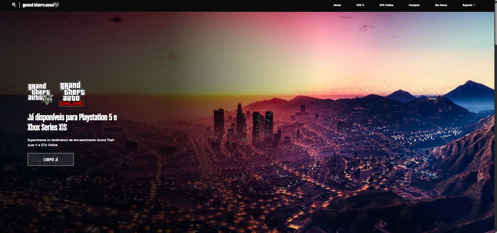
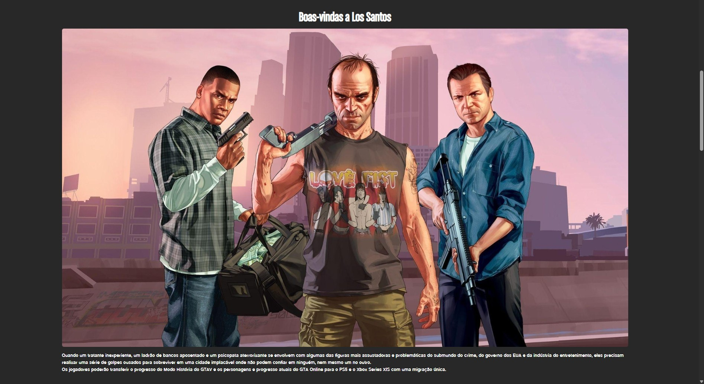
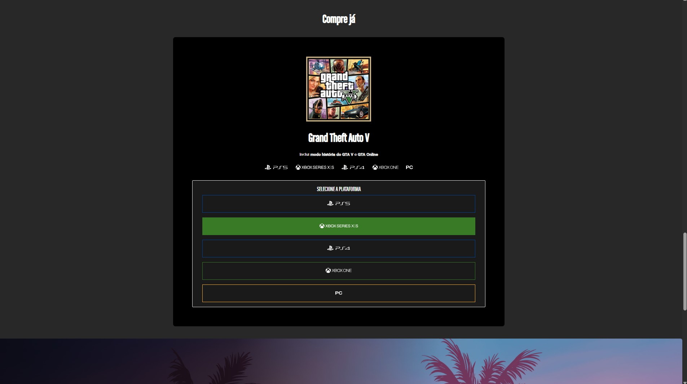
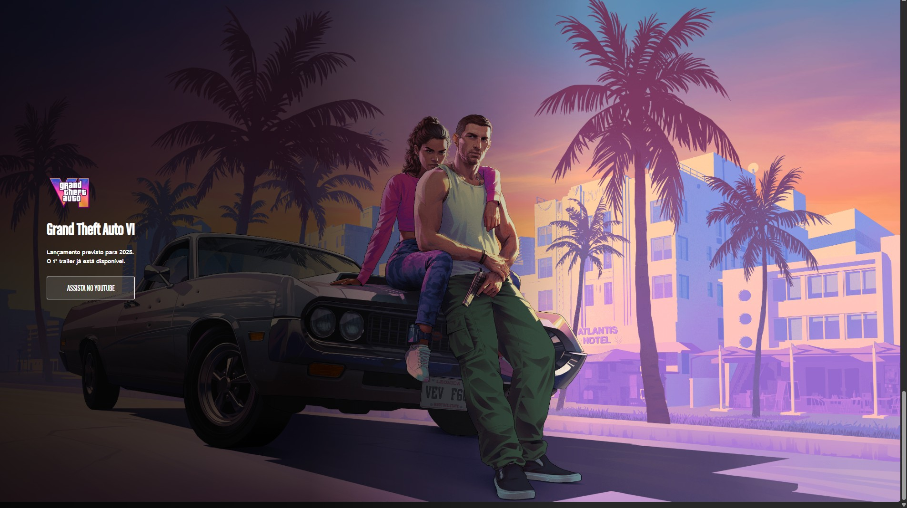

# 🔥 GTA Landing Page

This project is a landing page inspired by the GTA universe, created during the Semana do Zero ao Programador Contratado by Dev em Dobro.
It was built as an early front-end learning project, focused on practicing HTML, CSS, and JavaScript.
The layout is not fully responsive, reflecting my skill level at the time.
I customized the visuals and layout to give the project a personal style and keep it as a milestone of my learning journey.

## 🛠️ Technologies Used
- HTML
- CSS
- JavaScript

## 👀 How to View
- To view the project locally, clone or download the repository and open the `index.html` file in your web browser. 
- Alternatively, visit the live version at [gsbado.github.io/projeto-gta/](https://gsbado.github.io/projeto-gta/).

## 🖼️ Assets
- **Images**: Located in `src/imagens/`
- **Fonts**: Located in `src/fontes/`
- **Stylesheets**: 
  - `src/css/estilos.css`
  - `src/css/fontes.css`
  - `src/css/reset.css`
  - `src/css/responsivo.css`

## 🙌 Credits
- Original Page concept: Dev em Dobro - Semana do Zero ao Programador Contratado
- Inspiration theme and images: Grand Theft Auto V
- Modified by Gabriela Spanemberg Bado

## 📄 License
This project is for educational purposes.

## 🖥️ Preview

> Examples of the project interface.
